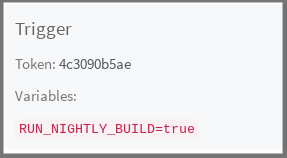

# Triggering Builds through the API

_**Note:** This feature was [introduced][ci-229] in GitLab CE 7.14_

Triggers can be used to force a rebuild of a specific branch, tag or commit,
with an API call.

## Add a trigger

You can add a new trigger by going to your project's **Settings > Triggers**.
The **Add trigger** button will create a new token which you can then use to
trigger a rebuild of this particular project.

Every new trigger you create, gets assigned a different token which you can
then use inside your scripts or `.gitlab-ci.yml`. You also have a nice
overview of the time the triggers were last used.


## Revoke a trigger

You can revoke a trigger any time by going at your project's
**Settings > Triggers** and hitting the **Revoke** button. The action is
irreversible.

## Trigger a build

To trigger a build you need to send a `POST` request to GitLab's API endpoint:

```
POST /projects/:id/trigger/builds
```

The required parameters are the trigger's `token` and the Git `ref` on which
the trigger will be performed. Valid refs are the branch, the tag or the commit
SHA. The `:id` of a project can be found by [querying the API](../api/projects.md)
or by visiting the **Triggers** page which provides self-explanatory examples.

When a rebuild is triggered, the information is exposed in GitLab's UI under
the **Builds** page and the builds are marked as `triggered`.


---

You can see which trigger caused the rebuild by visiting the single build page.
The token of the trigger is exposed in the UI as you can see from the image
below.


---

See the [Examples](#examples) section for more details on how to actually
trigger a rebuild.

## Pass build variables to a trigger

You can pass any number of arbitrary variables in the trigger API call and they
will be available in GitLab CI so that they can be used in your `.gitlab-ci.yml`
file. The parameter is of the form:

```
variables[key]=value
```

This information is also exposed in the UI.



---

See the [Examples](#examples) section below for more details.

## Examples

Using cURL you can trigger a rebuild with minimal effort, for example:

```bash
curl -X POST \
     -F token=TOKEN \
     -F ref=master \
     https://gitlab.example.com/api/v3/projects/9/trigger/builds
```

In this case, the project with ID `9` will get rebuilt on `master` branch.


### Triggering a build within `.gitlab-ci.yml`

You can also benefit by using triggers in your `.gitlab-ci.yml`. Let's say that
you have two projects, A and B, and you want to trigger a rebuild on the `master`
branch of project B whenever a tag on project A is created. This is the job you
need to add in project's A `.gitlab-ci.yml`:

```yaml
build_docs:
  stage: deploy
  script:
  - "curl -X POST -F token=TOKEN -F ref=master https://gitlab.example.com/api/v3/projects/9/trigger/builds"
  only:
  - tags
```

Now, whenever a new tag is pushed on project A, the build will run and the
`build_docs` job will be executed, triggering a rebuild of project B. The
`stage: deploy` ensures that this job will run only after all jobs with
`stage: test` complete successfully.

_**Note:** If your project is public, passing the token in plain text is
probably not the wisest idea, so you might want to use a
[secure variable](../variables/README.md#user-defined-variables-secure-variables)
for that purpose._

### Making use of trigger variables

Using trigger variables can be proven useful for a variety of reasons.

* Identifiable jobs. Since the variable is exposed in the UI you can know
  why the rebuild was triggered if you pass a variable that explains the
  purpose.
* Conditional job processing. You can have conditional jobs that run whenever
  a certain variable is present.

Consider the following `.gitlab-ci.yml` where we set three
[stages](../yaml/README.md#stages) and the `upload_package` job is run only
when all jobs from the test and build stages pass. When the `UPLOAD_TO_S3`
variable is non-zero, `make upload` is run.

```yaml
stages:
- test
- build
- package

run_tests:
  script:
  - make test

build_package:
  stage: build
  script:
  - make build

upload_package:
  stage: package
  script:
  - if [ -n "${UPLOAD_TO_S3}" ]; then make upload; fi
```

You can then trigger a rebuild while you pass the `UPLOAD_TO_S3` variable
and the script of the `upload_package` job will run:

```bash
curl -X POST \
  -F token=TOKEN \
  -F ref=master \
  -F "variables[UPLOAD_TO_S3]=true" \
  https://gitlab.example.com/api/v3/projects/9/trigger/builds
```

### Using cron to trigger nightly builds

Whether you craft a script or just run cURL directly, you can trigger builds
in conjunction with cron. The example below triggers a build on the `master`
branch of project with ID `9` every night at `00:30`:

```bash
30 0 * * * curl -X POST -F token=TOKEN -F ref=master https://gitlab.example.com/api/v3/projects/9/trigger/builds
```

[ci-229]: https://gitlab.com/gitlab-org/gitlab-ci/merge_requests/229
