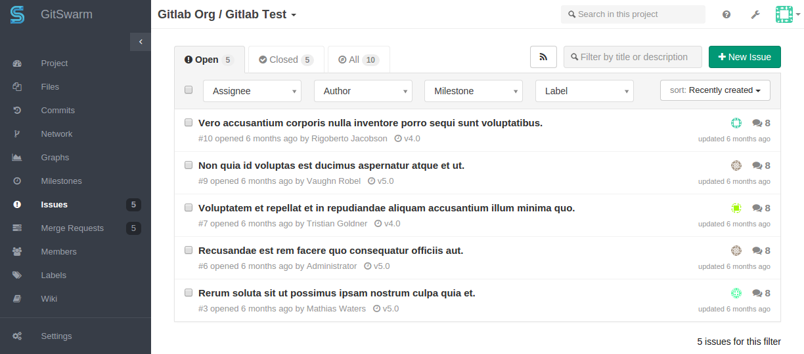

# External issue tracker

GitSwarm has a great issue tracker but you can also use an external issue
tracker such as JIRA or Redmine. Issue trackers are configurable per
GitSwarm project and allow you to do the following:

- the **Issuess**' link on the GitSwarm project pages takes you to the
  appropriate issue index of the external tracker
- clicking **New issue** on the project dashboard creates a new issue on
  the external tracker

FIXME:DEL:
FIXME:DEL:
FIXME:DEL:GitSwarm Enterprise Edition contains advanced JIRA support.

## Configuration

The configuration is done via a project's **Services**.

To enable an external issue tracker, you mugh configure the appropriate
**Service**. Visit the links below for details.

- [Redmine](../project_services/redmine.md)
- [Jira](jira.md)

### Service Template

To save you the hassle from configuring each project's service
individually, GitSwarm provides the ability to set Service Templates which
can then be overridden in each project's settings.

Read more on [Services
Templates](../project_services/services_templates.md).
