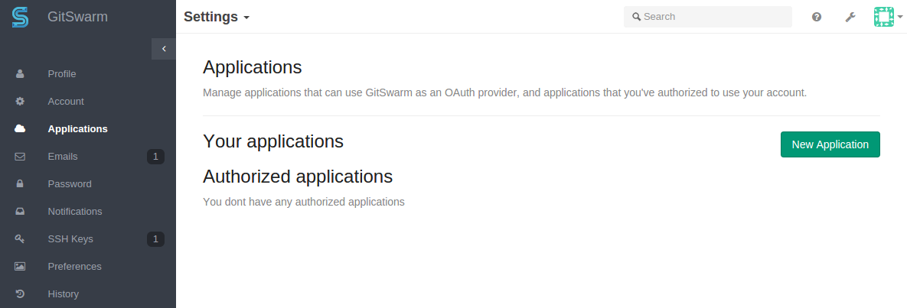
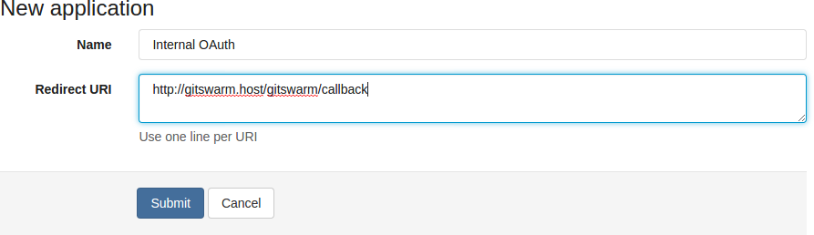
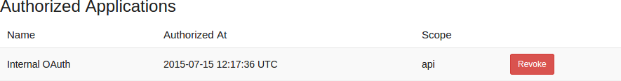
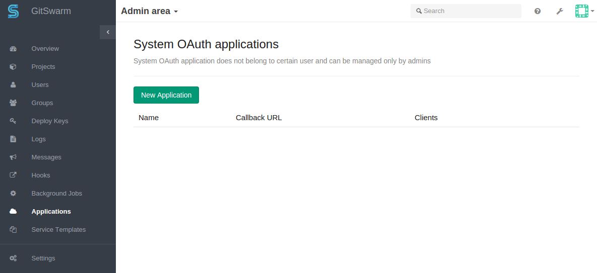

## GitSwarm as OAuth2 authentication service provider

This document is about using GitSwarm as an OAuth authentication service
provider to sign into other services. If you want to use other OAuth
authentication service providers to sign into GitSwarm, please see the
[OAuth2 client documentation](../api/oauth2.md)

OAuth2 provides client applications a 'secure delegated access' to server
resources on behalf of a resource owner. In other words, OAuth2 allows
authentication on one web site to inform authentication on another, and it
does so without transmitting the original credentials.

OAuth allows you to issue access tokens to third-party clients by an
authorization server, with the approval of the resource owner, or end-user.
Mostly, OAuth2 is used for SSO (Single sign-on). But you can find a lot of
different usages for this functionality. For example, the 'GitSwarm
Importer' feature uses the OAuth protocol to give access to repositories
without sharing user credentials to GitLab.com. Also, GitLab.com
authentication can be used for logging in to your GitSwarm instance if
needed [GitSwarm OmniAuth](gitlab.md).

GitSwarm has two ways to add new OAuth2 applications to an instance, you
can add application as regular user and via the admin area. There are no
differences between them except the different permission levels.

### Adding application through profile

Go to your profile section 'Application' and press button 'New
Application'.

After this, you see the application form where "Name" is an arbitrary
name, and "Redirect URI" is the URL in your app where users are sent after
authorization on GitLab.com.

### Authorized application

Every application you have authorized is shown in your "Authorized
application" sections.

At any time you can revoke access by clicking the "Revoke" button.

### OAuth applications in admin area

If you want to create an application that does not belong to a specific
user, you can create it from the admin area.

