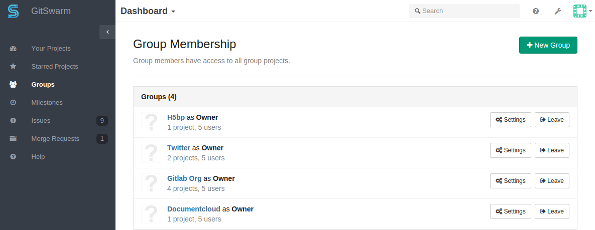
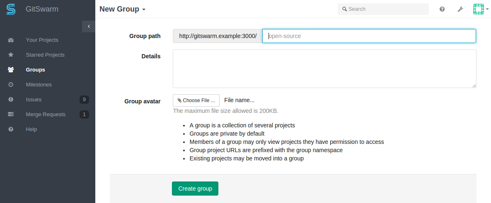
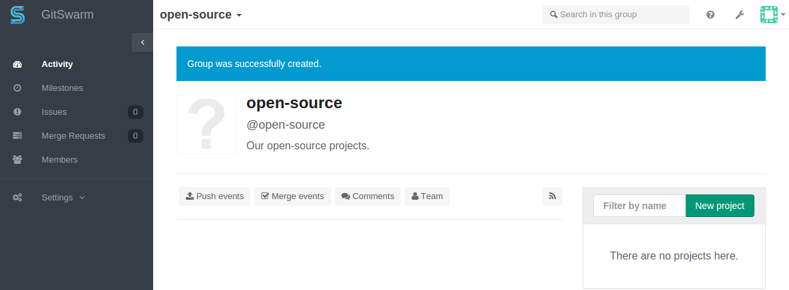
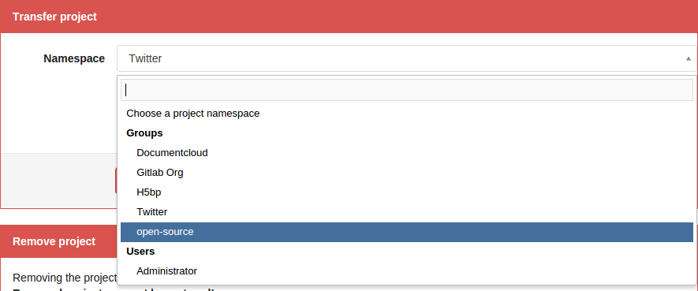
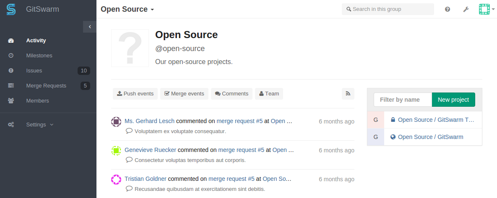
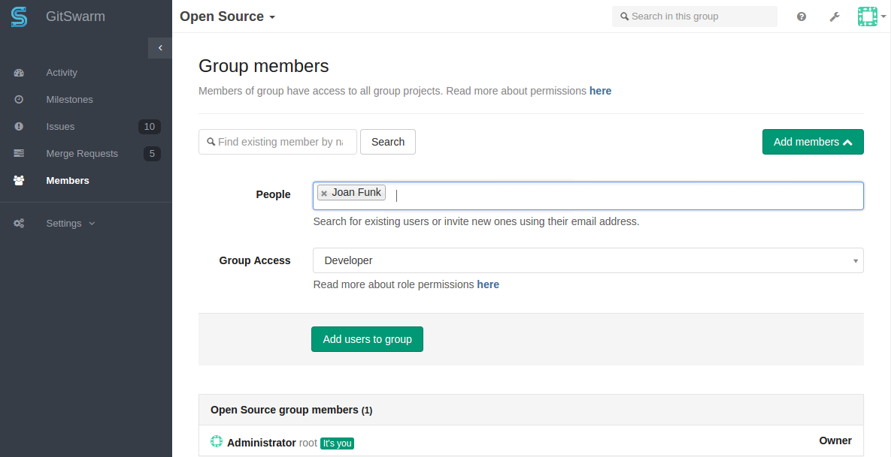
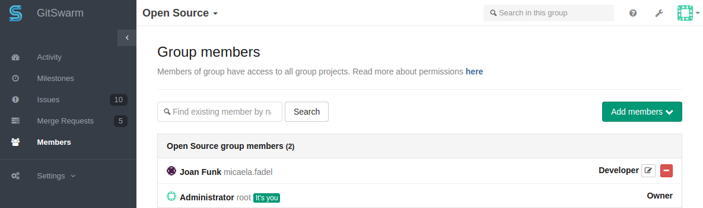
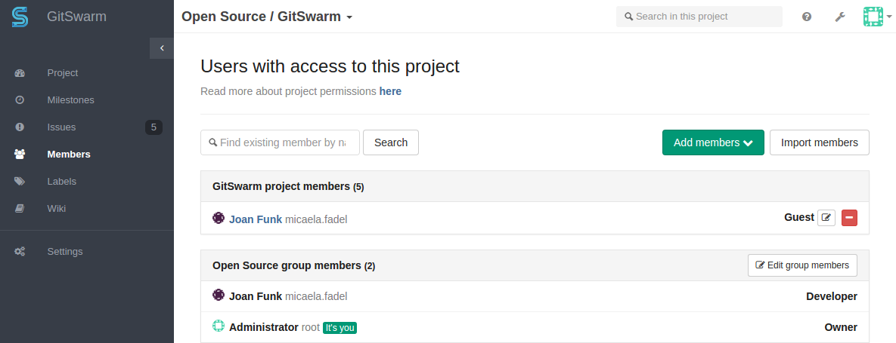

# GitSwarm Groups

GitSwarm groups allow you to group projects into directories and give users
to several projects at once.

When you create a new project in GitSwarm, the default namespace for the
project is the personal namespace associated with your GitSwarm user. In
this document we will see how to create groups, put projects in groups and
manage who can access the projects in a group.

## Creating groups

You can create a group by going to the 'Groups' tab of the GitSwarm
dashboard and clicking the 'New group' button.



Next, enter the name (required) and the optional description and group
avatar.



When your group has been created you are presented with the group dashboard
feed, which will be empty.



You can use the 'New project' button to add a project to the new group.

## Transferring an existing project into a group

You can transfer an existing project into a group you own from the project
settings page.

First scroll down to 'Transfer project'. Now you can pick any of the
groups you manage as the new namespace for the group.



GitSwarm administrators can use the admin interface to move any project to
any namespace if needed.

## Adding users to a group

One of the benefits of putting multiple projects in one group is that you
can give a user to access to all projects in the group with one action.

Suppose we have a group with two projects.



On the 'Group Members' page we can now add a new user Joan Funk to the
group.



Now, because Joan Funk is a 'Developer' member of the 'Open Source' group,
she automatically gets 'Developer' access to all projects in the 'Open
Source' group.



If necessary, you can increase the access level of an individual user for a
specific project, by adding them as a Member to the project.



## Managing group memberships via LDAP

In GitSwarm Enterprise Edition, it is possible to manage GitSwarm group memberships using LDAP groups.

## Allowing only admins to create groups

By default, any GitSwarm user can create new groups. This ability can be
disabled for individual users from the admin panel. It is also possible to
configure GitSwarm so that new users default to not being able to create
groups:

```
# Put the following in /etc/gitswarm/gitswarm.rb
gitlab_rails['gitlab_default_can_create_group'] = false
```
