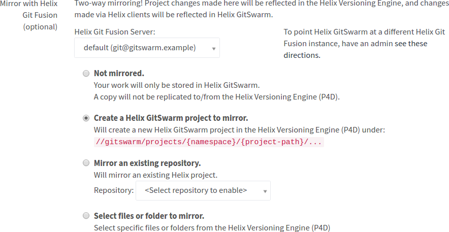
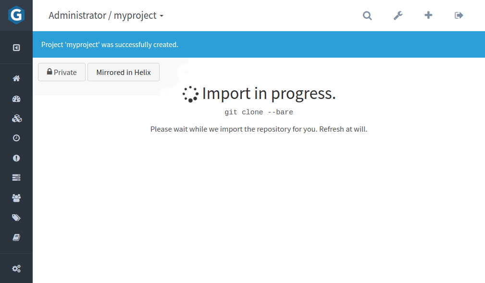
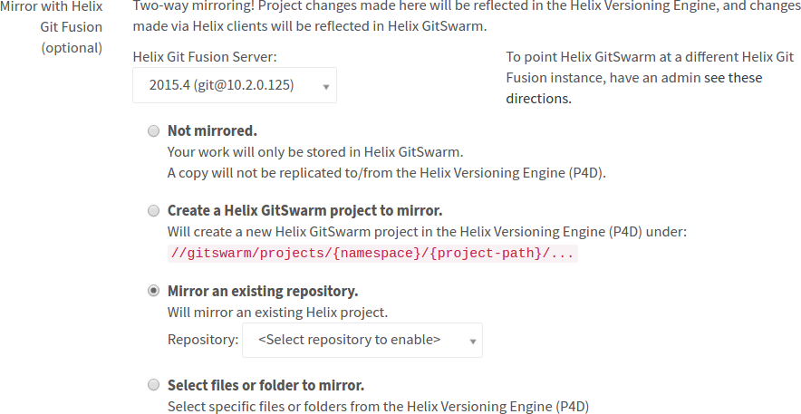
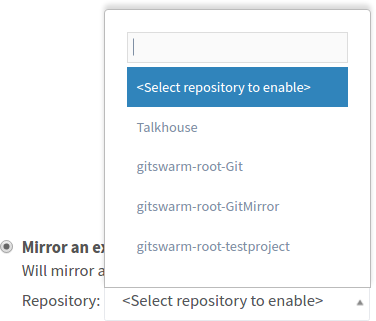
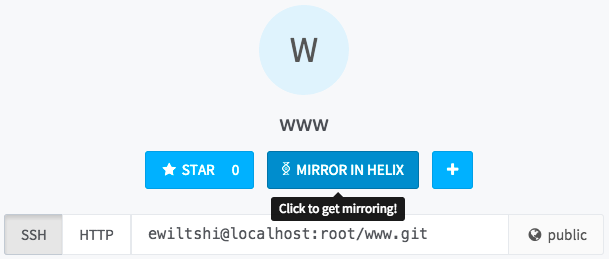
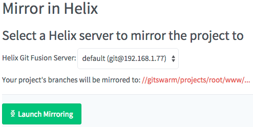
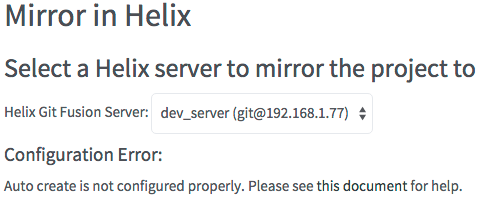

# Enable Helix Mirroring

> **Important:** Be sure to [configure](configuration.md) GitSwarm prior to
> attempting to enable Helix mirroring.

There are several scenarios where Helix Mirroring can be enabled:

- When you want to [create a
  GitSwarm project with convention-based
  mirroring](#new-gitswarm-project-with-convention-based-mirroring).
- When you want to [import a Git Fusion
  repository](#importing-a-git-fusion-repository).
- When you want to [create a GitSwarm project from files or folders in the
  Helix Versioning Engine](#importing-from-the-helix-versioning-engine).
- When you have an [existing GitSwarm
  project](#enabling-mirroring-on-an-existing-gitswarm-project).

## Create a GitSwarm Project with Convention-based Mirroring

> **Note**: If your [configuration](configuration.md) is incorrect,
> this option is disabled:
>
> 

1.  Sign in to your GitSwarm instance and go to your dashboard.

1.  Click "New Project".

1.  Click the "Git Fusion Server" drop-down menu to select an available Git
    Fusion Server that your project should be mirrored to.

1.  Click "Create a Helix GitSwarm project to mirror":

    ----
    
    ----

1.  Fill in the rest of the details for your project.

1.  Click "Create Project".

    While the import is underway, a progress screen is displayed:

    ----
    
    ----

## Importing a Git Fusion Repository

1.  Sign in to your GitSwarm instance and go to your dashboard.

1.  Click "New Project".

1.  Click the "Helix Git Fusion Server" drop-down menu to select an
    available Git Fusion Server to import from.

1.  Click 'Mirror an existing repository'.

    ----
    
    ----

1.  Click the "Repository" drop-down menu under the "Mirror an existing
    repository" option and select an available Git Fusion repository to
    import:

    ----
    
    ----

1.  Fill in the rest of the details for your project.

1.  Click "Create Project".

    While the import is underway, a progress screen is displayed:

    ----
    
    ----

## Create a GitSwarm project from files or folders in the Helix Versioning
   Engine

1.  Sign in to your GitSwarm instance, and go to your dashboard.

1.  Click "New Project".

1.  Click "Select files or folder to mirror".

    ----
    
    ----


## Enabling Mirroring on an Existing GitSwarm Project

### Requirements

*   You must have at least one Git Fusion entry configured for
    convention-based mirroring. See [this
    section](#convention-based-repository-configuration) for details.

*   Your GitSwarm user account must either be an admin account, or you must
    have at least master-level permissions for the project on which you are
    attempting to enable mirroring.

*   The project cannot already be mirrored in Git Fusion.

*   There must not be any content in Helix where the to-be mirrored
    project's files are to be stored. GitSwarm checks for this before
    attempting to mirror the project.

*   There must not be a Git Fusion configuration file (```p4gf_config```)
    for the current namespace/project path combination. GitSwarm checks for
    this before attempting to mirror the project.

### How to Enable Mirroring on an Existing GitSwarm Project

1.  **Sign in to your GitSwarm instance**

    You must be an admin, or have at least master rights to the project for
    which you want to enable mirroring.

1.  **From the Dashboard, click "Your Projects" or "Explore Projects"**

1.  **Click on the project you wish to mirror**

1.  **Click the "Mirror in Helix" button on the project details page**

    If the button is greyed out, mousing over it gives a hint as to what is
    wrong and how to fix it.

    

1.  **Select the Git Fusion server to which you wish to mirror your
    project**

    All configured Git Fusion servers are selectable, but only servers that
    support convention-based mirroring enable the "Launch Mirroring"
    button.

    

    If you have selected a server for which there is a problem (e.g. that
    particular server does not have auto-create enabled, or has an
    incorrect username/password), GitSwarm reports that this is the case,
    describes what the problem is, and suggests how to fix it. For example:

    

1.  **Clicking the "Launch Mirroring" button**

    This starts the mirroring process. Assuming there are no configuration
    errors, GitSwarm attempts to:
    *   Create an associated repository in Git Fusion
    *   Mark the GitSwarm project as mirrored in Git Fusion
    *   Perform an initial push (backgrounded) of the GitSwarm project to
        Git Fusion

    If any errors occur during the above process, GitSwarm takes you back
    to the Mirror in Helix page, and report the error. See below for
    potential error messages, what they mean and how to fix them.

## Error Messages

*   **GitSwarm's Helix Git Fusion integration is disabled.**

    Getting this error message means that Git Fusion integration is
    currently disabled for your GitSwarm instance. You need to get an admin
    to [enable it](#configuration) for the Git Fusion servers against which
    you wish to enable mirroring.

*   **GitSwarm's Helix Git Fusion integration is enabled, however no Git
    Fusion instances have been configured.**

    In order to mirror an existing GitSwarm project, you must not only have
    Git Fusion enabled, but you must have at least one Git Fusion server
    instance configured. Please see [this section](#configuration) for
    instructions on configuring a Git Fusion instance.

*   **None of the Helix Git Fusion instances GitSwarm knows about are
    configured for 'auto create'.**

    When mirroring an existing GitSwarm project in Git Fusion, GitSwarm
    must be configured to be able to create a Git Fusion repository
    definition. To do this, GitSwarm relies on the ```auto_create```
    section of the Git Fusion configuration. Please see [this
    section](#auto-create-configuration) for instructions on configuring
    auto create.

*   **GitSwarm is configured for Helix mirroring, but you lack permissions
    to enable it for this project.**

    Enabling mirroring on an existing GitSwarm project requires permissions
    to edit that project. This means your GitSwarm user account either
    needs to be an administrator account, or at least master-level
    permissions for the project on which you wish to enable mirroring.

## Problems?

If you encounter problems with importing projects from Git Fusion, or with
mirroring between GitSwarm and Git Fusion, please contact
Perforce support <support@perforce.com> for assistance.
