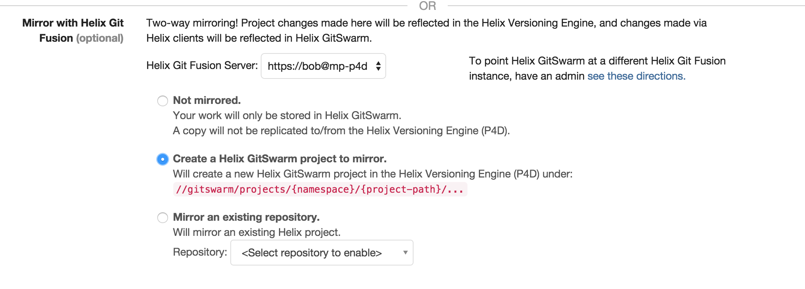
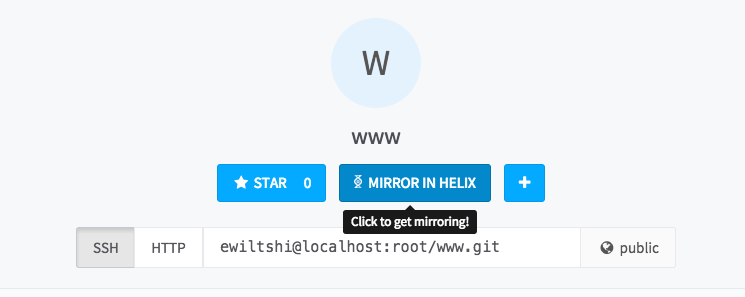
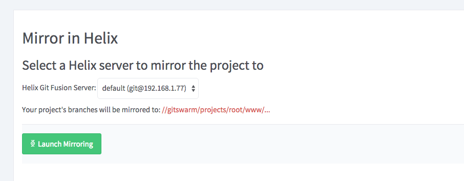

## Import from Helix Git Fusion into GitSwarm

Helix Git Fusion is a Git remote repository service that uses the Helix
Versioning Engine (P4D) as its back end. Users interact with Git Fusion as
they would with any other remote Git repository.

It takes just a few steps to import your existing Git Fusion projects into
GitSwarm. Additionally, for brand new projects; GitSwarm can automatically
configure a new Git Fusion repository and use it to mirror your work into
the Helix Versioning Engine (P4D).

Once imported, GitSwarm keeps the Git Fusion project up to date using
bi-directional mirroring; any changes pushed to a GitSwarm project are
mirrored to Git Fusion, and changes within the Git Fusion project (even if
initiated within the Helix Versioning Engine) are mirrored into the
GitSwarm project.

Mirroring your repositories to a Helix Versioning Engine through Git Fusion
makes it easy to use either Git or Helix applications to work on the same
set of files. Helix provides simplified interfaces which are easier for
some team members to learn and use than Git.

With Helix's exclusive file locking support, teams working with unmergable
digital assets can collaborate without overwriting each other's work. Git
Fusion respects these locks and prevents Git pushes from overwriting locked
files.

Additionally, mirroring through Git Fusion allows "narrow cloning," where
you create small Git repositories that are subsets of the much larger Helix
Versioning Engine monorepo. Git repositories perform best when the
repository is at most 1 GB in size, whereas a Helix Versioning Engine can
store petabytes of data.

You can create multiple Git repositories from overlapping sets of files
stored in a Helix Versioning Engine. Commits from one Git repo are
recreated in other repositories that share those files. Continuous
integration systems can run directly against the Helix Versioning Engine to
catch dependencies across Git repositories, while allowing developers to
work with smaller, high-performing repositories.

### Requirements

*   Helix Git Fusion 2015.2, or newer.
*   Helix GitSwarm 2015.3, or newer.
*   Helix Versioning Engine (P4D) version 2015.1/1171507, or newer.
    *   A user for GitSwarm's use in the Helix Versioning Engine with the
        following attributes:
        *   a normal user (not operator or service users)
        *   a member of the `git-fusion-pull` group
        *   must have write access via Helix protections to:
            *   `//.git-fusion/repos/...` (to allow GitSwarm to create
                `auto_create` repos)
            *   `//.git-fusion/users/<GitSwarm user>/...` (for SSH access)
            *   `//<all Git Fusion depot roots accessed by GitSwarm>`

### Recommendations

*   Install GitSwarm and Git Fusion on separate machines to improve
    performance and scalability. GitSwarm 2015.3+ installs with a local
    Helix Versioning Engine and a local Git Fusion server, all
    pre-configured to allow you to easily try out the system. In
    production, we recommend disabling the local Git Fusion, and using an
    external one. [Check out the docs on the auto-provisioned Git
    Fusion](../../install/auto_provision.md))

*   Use SSH or HTTPS connections to secure the mirroring connections.
    SSH connections are faster and more secure. We recommend against using
    unencrypted HTTP connections or HTTPS with self-signed certificates.

### Configuration

Before you can import from Git Fusion, GitSwarm needs some configuration
that describes where the Git Fusions service(s) exist.

#### Global Configuration

GitSwarm supports a special server entry called `global`, which contains
overrides for usernames, passwords, git configuration parameters, and
convention-based repository settings.

```ruby
gitswarm['git-fusion']['global']['user']      = 'global-user'
gitswarm['git-fusion']['global']['password']  = '<password for "global-user" user>'
gitswarm['git-fusion']['local']['url']        = 'http://gitswarm@gitfusion.host/'
gitswarm['git-fusion']['local']['password']   = '<password for "gitswarm" user>'
gitswarm['git-fusion']['development']['url']  = 'http://dev-gitfusion.host/'
gitswarm['git-fusion']['production']['url']   = 'http://prod-gitfusion.host/'
```

In the above example, the user `global-user` is used to log in to the
`development` and `production` Git Fusion servers. The user for the `local`
Git Fusion server remains as `gitswarm`.

> Note: Only `user`, `password`, `git_config_params`, `perforce['user']`,
        `perforce['password']` and `auto_create` settings can have global
        defaults. Global settings for `url` and `perforce['port']` is
        ignored if present.
Git Fusion server remains `gitswarm`.

Note: Only `user`, `password`, `git_config_params`, `perforce['user']`,
`perforce['password']` and `auto_create` settings can have global defaults.
Global settings for `url` and `perforce['port']` is ignored if present.

> Note: The following priority is given to user/password lookups:
  1.  Entry-specific user/password keys
  1.  User/password specified on the Git Fusion server `url`
  1.  Global user/password
  1.  Default (`gitswarm` for user, `''` for password)

#### Using an HTTP(S) connection

1.  **Edit the following configuration in `/etc/gitswarm/gitswarm.rb`:**

    After the `gitswarm['git-fusion']['enabled']` section:

    ```ruby
    gitswarm['git-fusion']['enabled']              = true
    gitswarm['git-fusion']['my_entry']['url']      = 'http://gitswarm@gitfusion.host/'
    gitswarm['git-fusion']['my_entry']['password'] = '<password for "gitswarm" user>'
    ```

    > Note: The user (e.g. `gitswarm`) needs to exist in the Helix
            Versioning Engine that the Git Fusion service uses, and must
            have permission to access the repositories you wish to import
            from.

    > Note: `my_entry` is an example key that is used to configure the
            connection to a particular Git Fusion server. Similarly, you
            can include configurations to other Git Fusion servers under
            other uniquely-named keys.

    ```ruby
    gitswarm['git-fusion']['local']['url']      = 'http://gitswarm@gitfusion.host/'
    gitswarm['git-fusion']['local']['password'] = '<password for "gitswarm" user>'
    gitswarm['git-fusion']['other']['url']      = 'http://other-user@other-gitfusin.host/'
    gitswarm['git-fusion']['other']['password'] = '<password for "other-user" user>'
    ```

    > Note: While we do not recommend using self-signed SSL certificates
            (and these should never be used in production), if you are
            using self-signed certificates for HTTPS connections in a test
            environment, you need to specify:

    ```ruby
    gitswarm['git-fusion']['my_entry']['git_config_params'] = 'http.sslVerify=false'
    ```

    > Note: the key `my_entry` can be replaced with a unique value of your
            choosing.

1.  **Make the configuration change active:**

    ```bash
    sudo gitswarm-ctl reconfigure
    ```

#### Using an SSH connection

1.  **Add the following configuration to `/etc/gitswarm/gitswarm.rb`:**

    ```ruby
    gitswarm['git-fusion']['enabled']               = true
    gitswarm['git-fusion']['my_entry']['url']       = 'git@gitfusion.host'
    gitswarm['git-fusion']['my_entry']['password']  = '<password for "gitswarm" user>'
    ```

1.  **Make this configuration change active:**

    ```bash
    sudo gitswarm-ctl reconfigure
    ```

To permit GitSwarm to connect to Git Fusion via SSH, follow these steps:

1.  **Get a copy of the `git` user's public SSH key**

    ```bash
    sudo cat ~git/.ssh/id_rsa.pub
    ```

1.  **Install the public key in the Git Fusion service.**

    This process involves interacting with the Helix Versioning Engine that
    the Git Fusion service connects to. The steps are described in the the
    [Git Fusion
    guide](http://www.perforce.com/perforce/doc.current/manuals/git-fusion/index.html),
    in the section [Authenticating Git Users using
    SSH](http://www.perforce.com/perforce/doc.current/manuals/git-fusion/appendix.ssh.html).

    > Note: When installing the public key on the Git Fusion service, a
            standard user with read/write access to the `//.git-fusion`
            depot needs to exist (we recommend `gitswarm`). The public key
            needs to be installed in Git Fusion/P4D for that user.

#### Convention-based Repository Configuration

In order for GitSwarm to automatically create new Git Fusion repositories
when adding projects, GitSwarm needs to connect to the Helix Versioning
Engine (P4D) directly. GitSwarm also needs to be configured with a path
where it can place the repositories files.

At a minimum, GitSwarm needs to be configured with a user id and password
for the connection. When using HTTP(S), this information should already be
present. When using SSH, you may need to add the settings:

```ruby
gitswarm['git-fusion']['enabled']              = true
gitswarm['git-fusion']['my_entry']['url']      = 'git@gitfusion.host'
gitswarm['git-fusion']['my_entry']['user']     = '<perforce-user-id>'
gitswarm['git-fusion']['my_entry']['password'] = '<password for "gitswarm" user>'
```

> Note: If no `port` is specified under the `perforce` key, GitSwarm
        connects to the given Git Fusion instance and use the same port as
        Git Fusion (the `my_entry` Git Fusion instance in the above
        example).

If the auto-detected Perforce Port is incorrect, you may optionally specify
the appropriate value manually by setting:

```ruby
gitswarm['git-fusion']['my_entry']['perforce']['port']  = 'ssl:my-fusion:1666'
```

> Note: GitSwarm uses the following priority for determining user/password
  to connect to Perforce:
  1.    Entry-specific user/password keys
  1.    User/password specified on the Git Fusion server `url`
  1.    Global user/password
  1.    Default (`gitswarm` for user, `''` for password)

> Note: The user (e.g. `gitswarm`) needs to exist in the Helix Versioning
        Engine that the Git Fusion service uses, and must have permission
        to access the repositories you wish to import from.

> Note: The `my_entry` key is used to assign config values to a particular
        git-fusion instance. You can include more configured servers under
        other keys.

##### Auto-Create Configuration

GitSwarm generates a Git Fusion configuration and unique depot path for
each new project that has convention-based mirroring enabled. It constructs
these by substituting the GitSwarm project's namespace and project path
into a template that is specified in the configuration.

```ruby
gitswarm['git-fusion']['global']['auto_create']['path_template']      = '//gitswarm/projects/{namespace}/{project-path}'
gitswarm['git-fusion']['global']['auto_create']['repo_name_template'] = 'gitswarm-{namespace}-{project-path}'
```

> Note: `{namespace}` and `{project-path}` are substituted for the GitSwarm
        project's namespace and project path (name) when the project is
        created.

> Note: The depot specified in the `path_template` ('gitswarm' in the above
        example) must exist *prior* to attempting to use the
        convention-based repository feature. GitSwarm does *not* create
        this depot for you.

#### Sample Configuration

The following is a sample configuration for GitSwarm, including Helix
Versioning Engine integration, and auto-create settings:

```ruby
gitswarm['git-fusion']['enabled']                                       = true
gitswarm['git-fusion']['my_entry']['url']                               = 'git@gitfusion.host'
gitswarm['git-fusion']['my_entry']['user']                              = '<perforce-user-id>'
gitswarm['git-fusion']['my_entry']['password']                          = '<password for "gitswarm" user>'
gitswarm['git-fusion']['my_entry']['perforce']['port']                  = 'ssl:my-fusion:1666'
gitswarm['git-fusion']['my_entry']['auto_create']['path_template']      = '//gitswarm/projects/{namespace}/{project-path}'
gitswarm['git-fusion']['my_entry']['auto_create']['repo_name_template'] = 'gitswarm-{namespace}-{project-path}'
```

### New GitSwarm Project with Convention-based Mirroring

1.  Sign in to your GitSwarm instance and go to your dashboard.

1.  Click "New Project".

1.  Click the "Git Fusion Server" drop-down menu to select an available Git
    Fusion Server that your project should be mirrored to.

1.  Click the 'Create a Helix GitSwarm project to mirror'

    

1.  Fill in the rest of the details for your project.

1.  Click "Create Project".

    While the import is underway, a progress screen is displayed:

    

### Importing a Git Fusion Repository

1.  Sign in to your GitSwarm instance and go to your dashboard.

1.  Click "New Project".

1.  Click the "Helix Git Fusion Server" drop-down menu to select an
    available Git Fusion Server to import from.

1.  Click the "Repository" drop-down menu under the "Mirror an existing
    repository" option and select an available Git Fusion repository to
    import.

    

1.  Fill in the rest of the details for your project.

1.  Click "Create Project".

    While the import is underway, a progress screen is displayed:

    

### Enabling Mirroring on an Existing GitSwarm Project

#### Requirements

*   You must have at least one Git Fusion entry configured for
    convention-based mirroring. See [this
    section](#convention-based-repository-configuration) for details.

*   Your GitSwarm user account must either be an admin account, or you must
    have at least master-level permissions for the project on which you are
    attempting to enable mirroring.

*   The project cannot already be mirrored in Git Fusion.

*   There must not be any content in Helix where the to-be mirrored
    project's files are to be stored. GitSwarm checks for this before
    attempting to mirror the project.

*   There must not be a Git Fusion configuration file (```p4gf_config```)
    for the current namespace/project path combination. GitSwarm checks for
    this before attempting to mirror the project.

#### How to Enable Mirroring on an Existing GitSwarm Project

1.  **Sign in to your GitSwarm instance**

    You must be an admin, or have at least master rights to the project for
    which you want to enable mirroring.

1.  **From the Dashboard, click "Your Projects" or "Explore Projects"**

1.  **Click on the project you wish to mirror**

1.  **Click the "Mirror in Helix" button on the project details page**

    If the button is greyed out, mousing over it gives a hint as to what is
    wrong and how to fix it.

    

1.  **Select the Git Fusion server to which you wish to mirror your
    project**

    All configured Git Fusion servers are selectable, but only servers that
    support convention-based mirroring enable the "Launch Mirroring"
    button.

    

    If you have selected a server for which there is a problem (e.g. that
    particular server does not have auto-create enabled, or has an
    incorrect username/password), GitSwarm reports that this is the case,
    describes what the problem is, and suggests how to fix it. For example:

    

1.  **Clicking the "Launch Mirroring" button**

    This starts the mirroring process. Assuming there are no configuration
    errors, GitSwarm attempts to:
    *   Create an associated repository in Git Fusion
    *   Mark the GitSwarm project as mirrored in Git Fusion
    *   Perform an initial push (backgrounded) of the GitSwarm project to
        Git Fusion

    If any errors occur during the above process, GitSwarm takes you back
    to the Mirror in Helix page, and report the error. See below for
    potential error messages, what they mean and how to fix them.

#### Error Messages

*   **GitSwarm's Helix Git Fusion integration is disabled.**

    Getting this error message means that Git Fusion integration is
    currently disabled for your GitSwarm instance. You need to get an admin
    to [enable it](#configuration) for the Git Fusion servers against which
    you wish to enable mirroring.

*   **GitSwarm's Helix Git Fusion integration is enabled, however no Git
    Fusion instances have been configured.**

    In order to mirror an existing GitSwarm project, you must not only have
    Git Fusion enabled, but you must have at least one Git Fusion server
    instance configured. Please see [this section](#configuration) for
    instructions on configuring a Git Fusion instance.

*   **None of the Helix Git Fusion instances GitSwarm knows about are
    configured for 'auto create'.**

    When mirroring an existing GitSwarm project in Git Fusion, GitSwarm
    must be configured to be able to create a Git Fusion repository
    definition. To do this, GitSwarm relies on the ```auto_create```
    section of the Git Fusion configuration. Please see [this
    section](#auto-create-configuration) for instructions on configuring
    auto create.

*   **GitSwarm is configured for Helix mirroring, but you lack permissions
    to enable it for this project.**

    Enabling mirroring on an existing GitSwarm project requires permissions
    to edit that project. This means your GitSwarm user account either
    needs to be an administrator account, or at least master-level
    permissions for the project on which you wish to enable mirroring.

### Known Issues

*   Git Fusion, when installed on CentOS/RHEL 7.x, does not support HTTP(S)
    authentication. This issue prevents pushing new work to a Git Fusion
    repo, including any updates in GitSwarm that would be mirrored to Git
    Fusion. Instead, use SSH connections when Git Fusion is hosted on
    CentOS/RHEL 7.x.

*   GitSwarm project names can only contain letters, numbers, underscores,
    periods, and dashes, and must begin with a letter, number, or
    underscore.

    Since depot paths in the Helix Versioning Engine (P4D) can contain
    Unicode and other special characters, we recommend depot paths for
    projects you intend on importing into GitSwarm via Git Fusion adhere to
    the naming convention described above.

    If you are using multi-byte characters in any of your Git Fusion
    repository names, you should use an SSH connection to Git Fusion.

*   If a new project is created and GitSwarm is used to automatically
    mirror it (via convention-based mirroring), updating the project's
    namespace and/or project name does *not* change the location under
    Helix Versioning Engine (P4D). In order to move the project's files to
    a new location, you need to delete the project, re-create it with
    convention-based mirroring, and then re-add the files.

*   Once a project has been created with mirroring to Git Fusion, changing
    the settings in `/etc/gitswarm/gitswarm.rb` does not update the
    mirroring settings for the project (or any other project). This can
    result in problems that prevent pushing new changes to the project.
    Unfortunately, the solution is to delete the project, correct the
    settings in `gitswarm.rb`, and then re-create the project.

*   The following error can be displayed when Git Swarm is attempting to
    connect to a remote Helix Git Fusion server (running on Centos/RHEL
    6.6+) over SSH, as part of mirroring setup on the `Create Project`
    page.

    ```
    Git Fusion Server:
    There was an error communicating with Git Fusion:
    Using 'ascii' file encoding will ultimately result in errors, please set LANG/LC_ALL to 'utf-8' in environment configuration.
    ```

    You can work around this error by doing the following steps:

    1.  Connect (SSH) to the remote Helix Git Fusion server as a user with
        sudo access.

    1.  Determine the default LANG setting for the server.

        You can do this by running the command `locale`. It should be
        something like ```en_US.UTF-8```. If the system locale is not a
        UTF8 locale, please contact <support@perforce.com> for help on how
        to proceed.

    1.  Determine the Git Fusion OS user. This user is normally `git`, but
        may be different.

        The username should be in your `/etc/gitswarm/gitswarm.rb` file
        under the `[git-fusion][xxx][url]` setting. It should be in the
        format `username@hostname`.

    1.  Using sudo access and an editor of your choice, edit the .bashrc
        file of the Git Fusion OS user.

        You can find this file using the path `~username/.bashrc`
        (replacing username with the Git Fusion OS user).

        Add a line into the `.bashrc` file exporting the LANG setting you
        determined earlier. e.g. ```export LANG=en_US.UTF-8```

    1.  Save the file.

    1.  Refresh the `Create Project` page in GitSwarm. The error should be
        resolved.

### Problems?

If you encounter problems with importing projects from Git Fusion, or with
mirroring between GitSwarm and Git Fusion, please contact
Perforce support <support@perforce.com> for assistance.
