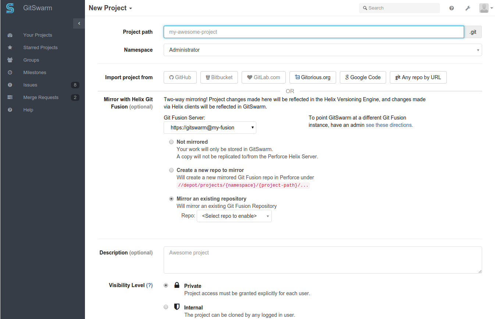
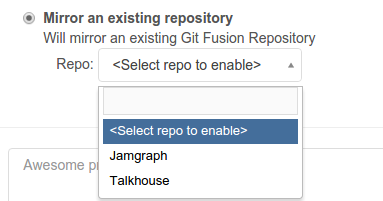
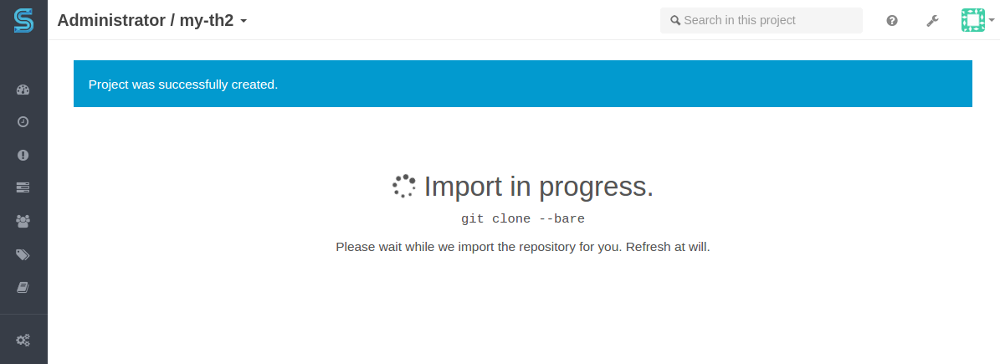

## Import from Git Fusion into GitSwarm

Helix Git Fusion is a Git remote repository service that uses the Helix
Versioning Engine (P4D) as its back end. Users interact with Git Fusion as
they would with any other Git remote repository.

It takes just a few steps to import your existing Git Fusion projects into
GitSwarm.

Once imported, GitSwarm keeps the GitFusion project up to date using
bi-directional mirroring; any changes pushed to a GitSwarm project are
mirrored to Git Fusion, and changes within the Git Fusion project (even if
initiated within the Helix Versioning Engine) are mirrored into the
GitSwarm project.

Note: the mirroring capability is not currently available for existing
projects in GitSwarm. Mirroring capability for all projects should be
available in a future GitSwarm release.

### Requirements

* Git Fusion 2015.2, or newer.

### Recommendations

* Install GitSwarm and Git Fusion on separate machines to improve
  performance and scalability.

* Use SSH or HTTPS connections to secure mirroring connections.

### Configuration

Before you can import from Git Fusion, GitSwarm needs some configuration
that describes where the Git Fusions service(s) exist.

Note: GitSwarm can currently only connect to a single Git Fusion service.

#### Using an HTTP(S) connection

Add the following configuration to `/etc/gitswarm/gitswarm.rb`:

```ruby
gitswarm['git-fusion']['enabled']             = true
gitswarm['git-fusion']['default']['url']      = 'http://gitswarm@gitfusion.host/'
gitswarm['git-fusion']['default']['password'] = '<password for "gitswarm" user>'
```

Note: The `gitswarm` user needs to exist in the Git Fusion service, and
have permission to access the repositories you wish to import from.

Note: If you are using self-signed certificates with SSL connections, you
may want to specify:

```ruby
gitswarm['git-fusion']['default']['git_config_params'] = 'http.sslVerify=false'
```

To make these configuration change active, run:

```bash
sudo gitswarm-ctl reconfigure
```

#### Using an SSH connection

Add the following configuration to `/etc/gitswarm/gitswarm.rb`:

```ruby
gitswarm['git-fusion']['enabled']                      = true
gitswarm['git-fusion']['default']['url']               = 'git@gitfusion.host'
```

To make this configuration change active, run:

```bash
sudo gitswarm-ctl reconfigure
```

To permit GitSwarm to connect to Git Fusion via SSH, follow these steps:

1.  **Log in to the GitSwarm machine**

    ```bash
ssh someuser@gitswarm.host
    ```

1.  **Start a new shell as the `git` user**

    ```bash
sudo su - git
    ```

1.  **Generate OpenSSH keys**

    `ssh-keygen` has many options for key generation. Here is an
    example:

    ```bash
ssh-keygen -t rsa -b 2048
    ```

    Note: do not generate keys with a passphrase; you do not have
    an opportunity to enter the passphrase whenever GitSwarm
    connects to Git Fusion.

1.  **Copy the public key you generated to the Git Fusion server**

    You can find the newly generated key in the `~/.ssh` folder. It
    has the suffix `.pub`.

    The public key needs to be appended to the `git` user's
    `~/.ssh/authorized_keys` file. Make sure that the correct permissions
    are set on this file:

    ```bash
chmod 600 ~/.ssh/authorized_keys
    ```

1.  **Verify the SSH key fingerprint**

    This step "activates" the key for use by GitSwarm. Run this step
    from the GitSwarm server.

    ```bash
ssh git@gf_host
    ```

    Note: if you encounter an error, you can ignore it. The goal is
    to verify the key fingerprint.

1.  **Log out**

    Disconnect from the `gf_host`. Exit from the shell running as
    `git`.

### Importing a Git Fusion Repository

1.  Sign in to your GitSwarm instance and go to your dashboard.
1.  Click "New Project".

    

1.  Click the "Repo" drop-down menu and select an available
    Git Fusion repository to import.

    

1.  Fill in the rest of the details for your project.

1.  Click "Create Project".

    While the import is underway, a progress screen is displayed:

    

### Known Issues

* Git Fusion, when installed on CentOS 7 or RHEL 7, does not support
  HTTP(S) authentication. This issue prevents pushing new work to a
  Git Fusion repo, including any updates in GitSwarm that would be
  mirrored to Git Fusion. Instead, use SSH connections when Git Fusion
  is hosted on CentOS/RHEL 7.

* For projects that are mirrored between GitSwarm and Git Fusion, the
  project name can only contain letters, numbers, underscores, periods,
  dashes, and spaces. Project names must begin with a letter, number,
  or underscore.

  Any projects that were originally created within the Helix Versioning
  Engine (P4D) can contain Unicode and other special characters. When
  you import a project from Git Fusion, the project name you provide to
  GitSwarm must adhere to the naming convention described above.

  If you are using multi-byte characters in any of your Git Fusion
  repository names, you should use an SSH connection to Git Fusion.

* Once a project has been created with mirroring to Git Fusion, changing
  the settings in `/etc/gitswarm/gitswarm.rb` does not update the
  mirroring settings for the project (or any other project). This can
  result in problems that prevent using the project in any way.
  Unfortunately, the solution is to delete the project, correct the
  settings in `gitswarm.rb`, and then re-create the project.

### Problems?

If you encounter problems with importing projects from Git Fusion, or with
mirroring between GitSwarm and Git Fusion, please contact
Perforce support <support@perforce.com> for assistance.
