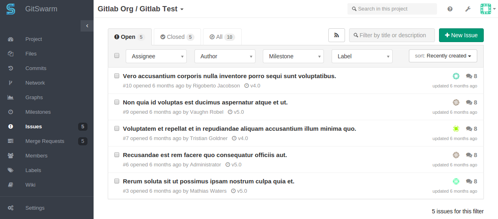
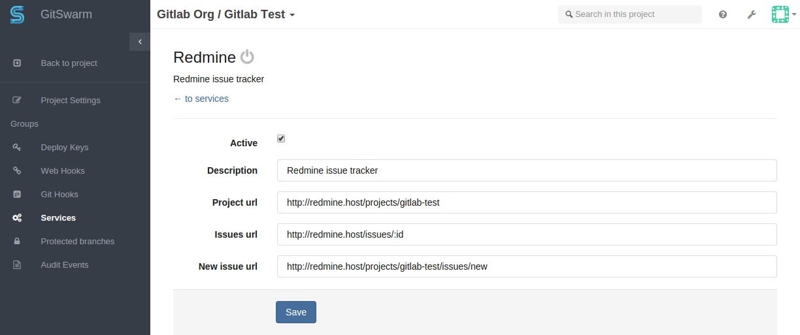
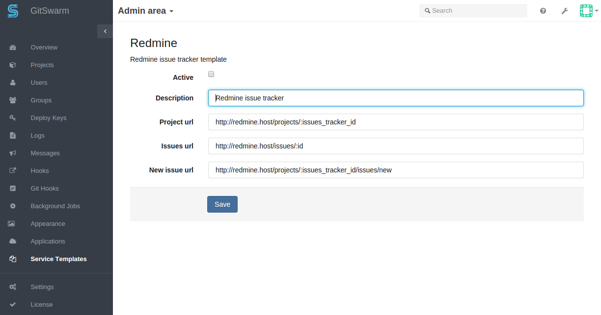

# External issue tracker

GitSwarm EE has a great issue tracker but you can also use an external
issue tracker such as JIRA, Bugzilla or Redmine. You can configure issue
trackers per GitSwarm project. For instance, if you configure JIRA it
allows you to do the following:

- the 'Issues' link on the GitSwarm project pages takes you to the
  appropriate Jira issue index;
- clicking 'New issue' on the issues page creates a new JIRA issue;
- To reference JIRA issue PROJECT-1234 in comments, use syntax
  PROJECT-1234. Commit messages get turned into HTML links to the
  corresponding JIRA issue.

[Advanced JIRA support](jira.md) is included.

## Configuration

### Project Service

You can enable an external issue tracker per project. As an example, we
will configure `Redmine` for project named gitswarm-test.

Fill in the required details on the page:

* `description` A name for the issue tracker (to differentiate between
  instances, for example).
* `project_url` The URL to the project in Redmine which is being linked to
  this GitSwarm EE project.
* `issues_url` The URL to the issue in Redmine project that is linked to
  this GitSwarm EE project. Note that the `issues_url` requires `:id` in
  the url. This id is used by GitSwarm EE as a placeholder to replace the
  issue number.
* `new_issue_url` This is the URL to create a new issue in Redmine for the
  project linked to this GitSwarm EE project.

### Service Template

It is necessary to configure the external issue tracker per project,
because project specific details are needed for the integration with
GitSwarm EE. The admin can add a service template that sets a default for
each project. This makes it much easier to configure individual projects.

In GitSwarm EE Admin section, navigate to `Service Templates` and choose
the service template you want to create:

After the template is created, the template details will be pre-filled on
the project service page.

NOTE: For each project, you will still need to configure the issue tracking
URLs by replacing `:issues_tracker_id` in the above screenshot with the ID
used by your external issue tracker.

Support to [add your commits to the Jira ticket automatically](jira.md) is
available.
