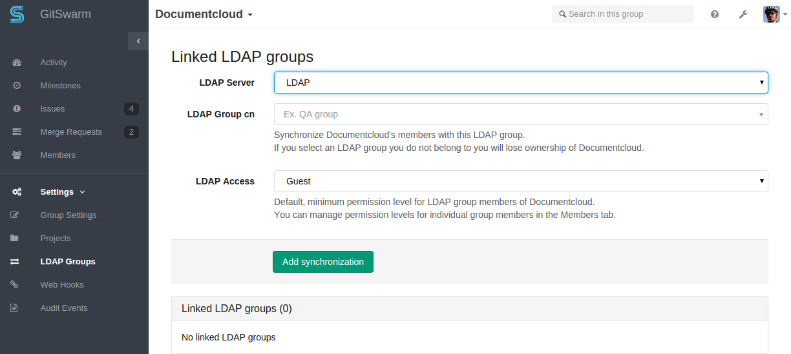

# GitSwarm EE LDAP integration

GitSwarm EE can be configured to allow your users to sign with their LDAP
credentials to integrate with e.g. Active Directory.

To enable LDAP integration, add the following to `/etc/gitswarm/gitswarm.rb`,
edited for your server. Note that multiple LDAP server configurations can be
included.

```ruby
gitlab_rails['ldap_enabled'] = true
gitlab_rails['ldap_servers'] = YAML.load <<-EOS # remember to close this block with 'EOS' below
main: # 'main' is the GitSwarm EE 'provider ID' of this LDAP server
  label: 'LDAP'
  host: '_your_ldap_server'
  port: 389
  uid: 'sAMAccountName'
  method: 'plain' # "tls" or "ssl" or "plain"
  bind_dn: '_the_full_dn_of_the_user_you_will_bind_with'
  password: '_the_password_of_the_bind_user'
  active_directory: true
  allow_username_or_email_login: false
  block_auto_created_users: false
  base: ''
  user_filter: ''
  group_base: ''
  admin_group: ''
  sync_ssh_keys: false

secondary: # 'secondary' is the GitSwarm EE 'provider ID' of second LDAP server
  label: 'LDAP'
  host: '_your_ldap_server'
  port: 389
  uid: 'sAMAccountName'
  method: 'plain' # "tls" or "ssl" or "plain"
  bind_dn: '_the_full_dn_of_the_user_you_will_bind_with'
  password: '_the_password_of_the_bind_user'
  active_directory: true
  allow_username_or_email_login: false
  block_auto_created_users: false
  base: ''
  user_filter: ''
  ## EE only
  group_base: ''
  admin_group: ''
  sync_ssh_keys: false
EOS
```

After making the configuration changes, run the follow for the LDAP settings to take effect:

```
sudo gitswarm-ctl reconfigure
```

The first time a user signs in with LDAP credentials, GitSwarm EE creates a new
GitSwarm EE user associated with the LDAP Distinguished Name (DN) of the LDAP
user.

GitSwarm EE user attributes such as nickname and email will be copied from the
LDAP user entry.

If you are getting 'Connection Refused' errors when trying to connect to
the LDAP server please double-check the LDAP `port` and `method` settings
used by GitSwarm EE. Common combinations are `method: 'plain'` ands
`port: 389`, OR `method: 'ssl'` and `port: 636`.

## Security

GitSwarm EE assumes that LDAP users are not able to change their LDAP 'mail',
'email' or 'userPrincipalName' attribute. An LDAP user who is allowed to change
their email on the LDAP server can take over any account on your GitSwarm EE
server.

We recommend against using GitSwarm EE LDAP integration if your LDAP users are
allowed to change their 'mail', 'email' or 'userPrincipalName'  attribute on
the LDAP server.

## Enabling LDAP sign-in for existing GitSwarm EE users

When a user signs in to GitSwarm EE with LDAP for the first time, and their
LDAP email address is the primary email address of an existing GitSwarm EE
user, then the LDAP DN will be associated with the existing user.

If the LDAP email attribute is not found in GitSwarm EE's database, a new user
is created.

In other words, if an existing GitSwarm EE user wants to enable LDAP sign-in
for themselves, they should check that their GitSwarm EE email address matches
their LDAP email address, and then sign into GitSwarm EE via their LDAP
credentials.

GitSwarm EE recognizes the following LDAP attributes as email addresses:
`mail`, `email` and `userPrincipalName`.

If multiple LDAP email attributes are present, e.g. `mail: foo@bar.com` and
`email: foo@example.com`, then the first attribute found wins -- in this case
`foo@bar.com`.

## LDAP group synchronization

LDAP group synchronization allows you to synchronize the members of a GitSwarm
EE group with one or more LDAP groups.

### Setting up LDAP group synchronization

Before enabling group synchronization, you need to make sure that the
`group_base` field is set in your LDAP settings on
your `/etc/gitswarm/gitswarm.rb` file. This setting tells GitSwarm EE where to
look for groups within your LDAP server.

```
group_base: 'OU=groups,DC=example,DC=com'
```

Suppose we want to synchronize the GitSwarm group 'example group' with the LDAP
group 'Engineering'.

1. As an owner, go to the group settings page for 'example group'.



As an admin you can also go to the group edit page in the admin area.


2. Enter 'Engineering' as the LDAP Common Name (CN) in the 'LDAP Group cn' field.

3. Enter a default group access level in the 'LDAP Access' field; let's say Developer.


4. Click 'Add synchronization' to add the new LDAP group link.

Now every time a member of the 'Engineering' LDAP group signs in, they
automatically become a Developer-level member of the 'example group' GitSwarm
EE group. Users who are already signed in will see the change in membership
after up to one hour.

### Synchronizing with more than one LDAP group

If you want to add the members of LDAP group to your GitSwarm EE group you can
add an additional LDAP group link. If you have two LDAP group links, e.g.
'cn=Engineering' at level 'Developer' and 'cn=QA' at level 'Reporter', and user
Jane belongs to both the 'Engineering' and 'QA' LDAP groups, she will get the
_highest_ access level of the two, namely 'Developer'.


### Locking yourself out of your own group

As an LDAP-enabled GitSwarm EE user, if you create a group and then set it to
synchronize with an LDAP group you do not belong to, you will be removed from
the group as soon as the synchronization takes effect for you, unless you are
the last owner of the group.

If you accidentally lock yourself out of your own GitSwarm EE group, ask
another owner of the group or a GitSwarm EE administrator to change the LDAP
synchronization settings for your group.

### Non-LDAP GitSwarm EE users

Your GitSwarm EE instance may have users on it for whom LDAP is not enabled.
If this is the case, these users will not be affected by LDAP group
synchronization settings: they will be neither added nor removed automatically.

### ActiveDirectory nested group support

If you are using ActiveDirectory, it is possible to create nested LDAP groups:
the 'Engineering' LDAP group may contain another LDAP group 'Software', with
'Software' containing LDAP users Alice and Bob. GitSwarm EE will recognize Alice
and Bob as members of the 'Engineering' group.

## Define GitSwarm EE admin status via LDAP

It is possible to configure GitSwarm EE so that GitSwarm EE admin rights are
bestowed on the members of a given LDAP group. GitSwarm EE administrator users
who do not have LDAP enabled are not affected by the LDAP admin group feature.

### Enabling the admin group feature

Below we assume that you have an LDAP group with the common name (CN) 'GitSwarm
EE administrators' containing the users that should be GitSwarm EE
administrators. We recommend that you keep a non-LDAP GitSwarm EE
administrator user around on your GitSwarm EE instance in case you
accidentally remove the admin status from your own LDAP-enabled GitSwarm EE
user.

Add the following to the LDAP part of `/etc/gitswarm/gitswarm.rb` under one (or
more) of the servers in the `servers:` section and run `sudo gitswarm-ctl
reconfigure`.

```yaml
    admin_group: 'GitSwarm EE administrators'
```

## Synchronising user SSH keys with LDAP

It is possible to configure GitwSwarm EE so that users have their SSH public
keys synchronised with an attribute in their LDAP object.  Existing SSH public
keys that are manually manged in GitSwarm EE are not affected by this feature.

### Enabling the key synchronisation feature

Below we assume that you have LDAP users with an attribute  'sshpublickey'
containing the users ssh public key.

Add the following to `/etc/gitswarm/gitswarm.rb` and run `sudo gitswarm-ctl reconfigure`.

```ruby
gitlab_rails['ldap_sync_ssh_keys'] = 'sshpublickey'
```

## Using an LDAP filter to limit access to your GitSwarm EE server

If you want to limit all GitSwarm EE access to a subset of the LDAP users on
your LDAP server you can set up an LDAP user filter.
The filter must comply with [RFC 4515](http://tools.ietf.org/search/rfc4515).

```ruby
gitlab_rails['ldap_servers'] = YAML.load <<-EOS
main:
  # snip...
  user_filter: '(employeeType=developer)'
EOS
```

Tip: if you want to limit access to the nested members of an Active Directory
group you can use the following syntax:

```
(memberOf:1.2.840.113556.1.4.1941:=CN=My Group,DC=Example,DC=com)
```

Please note that GitSwarm EE does not support the custom filter syntax used by
omniauth-ldap.

## Integrate GitSwarm EE with more than one LDAP server

It is possible to give users from more than one LDAP server access to the same
GitSwarm EE server.

Add new LDAP servers via `/etc/gitswarm/gitswarm.rb`. Remember to run `sudo
gitswarm-ctl reconfigure` for the new servers to become available.

Tip: you can assign labels to the different servers to give them human-friendly names.

```
ldap:
  servers:
    main:
      label: 'LDAP HQ'
```

## Automatic Daily LDAP Sync

GitSwarm EE now automatically syncs all LDAP members on a daily basis. You can
configure the time that it happens.

LDAP group synchronization in GitSwarm EE works by periodically updating the
group memberships of _active_ GitSWarm EE users. If a GitSwarm EE user becomes
_inactive_ however, their group memberships in GitSwarm EE can start to lag
behind the LDAP server group memberships. GitSwarm EE also updates the LDAP
group memberships of inactive users, by doing a daily LDAP check for _all_
GitSwarm EE users.

> Example:
John Doe leaves the company and is removed from the LDAP server. At this point
he can no longer log in to GitSwarm EE. But because he is no longer active on
the GitSwarm EE server (he cannot log in!), his LDAP group memberships in
GitSwarm EE no longer get updated, and he stays listed as a group member on the
GitSwarm EE server.

> Within 24 hours of John being removed from the LDAP server, his user will
also stop being listed as member of any GitSwarm EE groups.

### Blocked users and Daily sync

If you use Active directory and you block user in AD - user will be
automatically blocked in GitSwarm EE during next LDAP Sync.

## LDAP Synchronization

LDAP membership is checked for a GitSwarm EE user:

- when they sign in to the GitSwarm EE instance
- on a daily basis
- on any request that they do, once the LDAP cache has expired (default 1 hour,
  configurable, cache is per user)

If you want a shorter or longer LDAP sync time, you can easily set this with
the `sync_time` attribute in your config.

Add `"sync_time"` in `/etc/gitswarm/gitswarm.rb` to your LDAP config, and run `sudo gitswarm-ctl reconfigure` for the new setting to take effect.

A typical LDAP configuration for GitSwarm EE installed with an Omnibus package
might look like this:

```
gitlab_rails['ldap_servers'] = YAML.load <<-EOS
main:
  label: 'LDAP'
  host: '_your_ldap_server'
  port: 636
  uid: 'sAMAccountName'
  method: 'ssl' # "tls" or "ssl" or "plain"
  bind_dn: '_the_full_dn_of_the_user_you_will_bind_with'
  password: '_the_password_of_the_bind_user'
  active_directory: true
  allow_username_or_email_login: false
  base: ''
  user_filter: ''
  sync_time: 1800
  ## EE only
  group_base: ''
  admin_group: ''
  sync_ssh_keys: false
EOS
```

Here, `sync_time` is set to `1800` seconds, meaning the LDAP cache will expire
every 30 minutes.

Please note that changing the LDAP sync time can influence the performance of
your GitSwarm EE instance.
