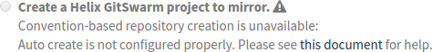
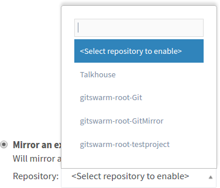
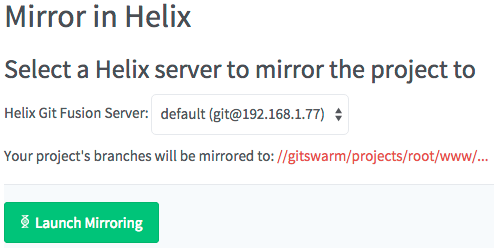
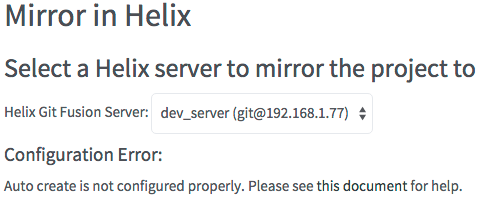
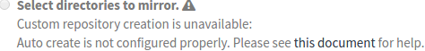
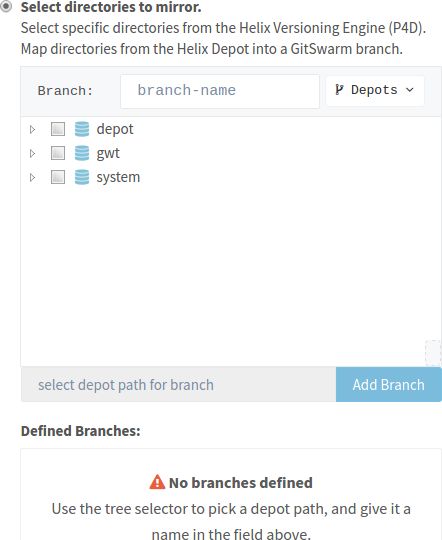
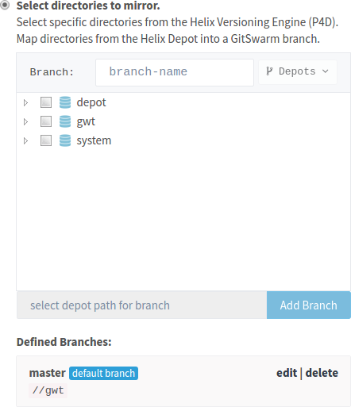
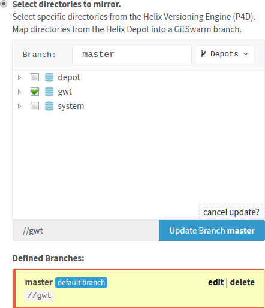

[Help](../../README.md)
/ [Workflow](../README.md)
/ [Helix Mirroring](README.md)
/ Enable

# Enable

## Requirements

*   You must have at least one Git Fusion entry configured in order to
    use Helix Mirroring, or to import a repo from Git Fusion.
    See the [configuration](configuration.md) section for details.

*   Your GitSwarm EE user account must either be an admin account, or you
    must have at least master-level permissions for the project on which
    you are attempting to enable Helix Mirroring.

*   The project cannot already be mirrored in Git Fusion.

*   When you use convention-based mirroring, there must not be any content
    in the Helix Versioning Engine where the to-be mirrored project's files
    are to be stored. GitSwarm EE checks for this before attempting to
    mirror the project.

*   When you use convention-based mirroring, there must not be a Git Fusion
    configuration file (```p4gf_config```) for the current
    namespace/project path combination. GitSwarm EE checks for this before
    attempting to mirror the project.

When the requirements have not been met, GitSwarm EE displays an 
[error message](#error_messages).

Once the requirements have been met, choose a scenario for Helix Mirroring:

- When you want to [create a
  GitSwarm EE project with convention-based
  mirroring](#new-gitswarm-ee-project-with-convention-based-mirroring).

- When you want to [import a Git Fusion
  repository](#importing-a-git-fusion-repository).

- When you have an [existing GitSwarm EE
  project](#enabling-mirroring-on-an-existing-gitswarm-ee-project).

- When you want to [create a GitSwarm EE project from directories in the
  Helix Versioning Engine](#importing-from-the-helix-versioning-engine).


## Create a GitSwarm EE Project with Convention-based Mirroring

> **Note**: If your [configuration](configuration.md) is incorrect,
> this option is disabled:
>
> 

1.  **Sign in to your GitSwarm EE instance and go to your dashboard.**

1.  **Click "New Project".**

1.  **Click the "Helix Git Fusion Server" drop-down menu to select an
    available Git Fusion Server.**

1.  **Click "Create a Helix GitSwarm EE project to mirror".**

1.  **Fill in the rest of the details for your project.**

1.  **Click "Create Project".**


## Importing a Git Fusion Repository

1.  **Sign in to your GitSwarm EE instance and go to your dashboard.**

1.  **Click "New Project".**

1.  **Click the "Helix Git Fusion Server" drop-down menu to select an
    available Git Fusion Server.**

1.  **Click "Mirror an existing repository".**

1.  **Select an available Git Fusion repository to import:**

    ----
    
    ----

1.  **Fill in the rest of the details for your project.**

1.  **Click "Create Project".**


## Enabling Mirroring on an Existing GitSwarm EE Project

1.  **Sign in to your GitSwarm EE instance**

    You must be an admin, or have at least master rights to the project for
    which you want to enable mirroring.

1.  **From the Dashboard, click "Your Projects" or "Explore Projects"**

1.  **Click on the project you wish to mirror**

1.  **Click the "Mirror in Helix" button on the project details page**

    If the button is greyed out, mousing over it gives a hint as to what is
    wrong and how to fix it.

    

1.  **Select the Git Fusion server to which you wish to mirror your
    project**

    All configured Git Fusion servers are selectable, but only servers that
    support convention-based mirroring enable the "Launch Mirroring"
    button.

    

    If you have selected a server for which there is a problem (e.g. that
    particular server does not have auto-create enabled, or has an
    incorrect username/password), GitSwarm EE reports that this is the case,
    describes what the problem is, and suggests how to fix it. For example:

    

1.  **Clicking the "Launch Mirroring" button**

    This starts the mirroring process. Assuming there are no configuration
    errors, GitSwarm EE attempts to:
    *   Create an associated repository in Git Fusion
    *   Mark the GitSwarm EE project as mirrored in Git Fusion
    *   Perform an initial push (backgrounded) of the GitSwarm EE project
        to Git Fusion

    If any errors occur during the above process, GitSwarm EE takes you
    back to the Mirror in Helix page, and report the error. [See
    below](#error-messages) for potential error messages, what they mean
    and how to fix them.


## Create a GitSwarm EE project from directories in the Helix Versioning Engine

> **Note**: If your [configuration](configuration.md) is incorrect,
> this option is disabled:
>
> 

1.  **Sign in to your GitSwarm EE instance, and go to your dashboard.**

1.  **Click "New Project".**

1.  **Click the "Helix Git Fusion Server" drop-down menu to select an
    available Git Fusion Server.**

1.  **Click "Select directories to mirror".**

    The depot browser is displayed, showing the available depot paths
    within the Helix Versioning Engine.

    ----
    
    ----

1.  **Use the "Depots" dropdown to choose whether you want to browse
    classic Helix depots or stream depots.**

1.  **Browse the depot to locate a directory.**

    Click the triangle to the left of each directory to see
    sub-directories.
    
    Click the checkbox to the left of a directory to select that directory
    (and all of its contents) to represent a Git branch within your project.

1.  **Specify the branch name in the "branch-name" field.**

1.  **Click "Add Branch <name>".**

    The "Defined Branches" area maintains a list of the named branches and
    the corresponding depot path.

    ----
    
    ----

1.  **Repeat steps 3-6 as many times as necessary to define all of the
    branches that should appear in your new project.**

1.  If you wish to **edit a branch name or associated depot path, click
    "edit".**
    
    The branch definition within the "Defined Branches" area becomes
    highlighted, and the depot browser updates to reflect the current name
    and depot path.

    ----
    
    ----

    If you change the branch name, click the "Change Branch <oldname> to
    <newname>" button to save your changes.

    If you change only the depot path, click the "Update Branch <name>"
    button to save your changes.

    At any time, click the "cancel update?" link to terminate editing the
    branch definition.

1.  If you specify more than one branch definition, you can **click 
    "make default" to specify which of the branch definitions should become
    the new project's default branch.**

1.  **Fill in the rest of the details for your project.**

1.  **Click "Create Project".**

>   **Warning:** If any of the branch definitions that you specify overlap,
>   those branches become read-only. For example, if you specify one branch
>   for `//depot` and another branch for `//depot/jam`, those two branch
>   definitions overlap because `jam` is inside `//depot`.

>   **Important:** Once you have created your project, the branch
>   definitions cannot be altered by GitSwarm EE. Modifications are
>   possible by having an administrator edit the Git Fusion `p4gf_config`
>   files.

>   **Important:** You are free to create new branches within the Git
>   repository for your GitSwarm EE project, but any new (and therefore,
>   unmapped) branches are considered to be "lightweight" branches in Git
>   Fusion. A lightweight branch has no project-specific mapping within the
>   Helix Versioning Engine, and so participation by developers using Helix
>   versioning is greatly reduced. See the [Git Fusion
>   guide](https://www.perforce.com/perforce/doc.current/manuals/git-fusion/chapter_dyn_ngj_3l.html#repos.lightweight_to_fullypopulated) for details.


## Error Messages

*   **GitSwarm EE's Helix Git Fusion integration is disabled.**

    Getting this error message means that Git Fusion integration is
    currently disabled for your GitSwarm EE instance. You need to get an
    admin to [enable it](#configuration) for the Git Fusion servers against
    which you wish to enable mirroring.

*   **GitSwarm EE's Helix Git Fusion integration is enabled, however no Git
    Fusion instances have been configured.**

    In order to mirror an existing GitSwarm EE project, you must not only
    have Git Fusion enabled, but you must have at least one Git Fusion
    server instance configured. Please see [this section](#configuration)
    for instructions on configuring a Git Fusion instance.

*   **None of the Helix Git Fusion instances GitSwarm EE knows about are
    configured for 'auto create'.**

    When mirroring an existing GitSwarm EE project in Git Fusion, GitSwarm
    EE must be configured to be able to create a Git Fusion repository
    definition. Please see [this section](#auto-create-configuration) for
    instructions on configuring auto create.

*   **GitSwarm EE is configured for Helix Mirroring, but you lack
    permissions to enable it for this project.**

    Enabling mirroring on an existing GitSwarm EE project requires
    permissions to edit that project. This means your GitSwarm EE user
    account either needs to be an administrator account, or at least
    master-level permissions for the project on which you wish to enable
    mirroring.

## Problems?

If you encounter problems with importing projects from Git Fusion, or with
Helix Mirroring between GitSwarm EE and Git Fusion, please contact
Perforce support <support@perforce.com> for assistance.
