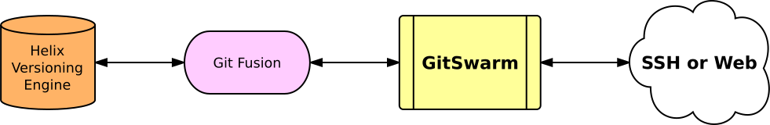

[Help](../../README.md)
/ [Workflow](../README.md)
/ [Helix Mirroring](README.md)
/ Overview

## Overview

Helix Git Fusion is a Git remote repository service that uses the Helix
Versioning Engine (P4D) as its back end. Users interact with Git Fusion as
they would with any other remote Git repository.

It takes just a few steps to mirror your existing Git Fusion projects into
GitSwarm EE. Additionally, for brand new projects; GitSwarm EE can
automatically configure a new Git Fusion repository and use it to mirror
your work into P4D.

Helix Mirroring allows you to specify the depot paths within the Helix
Versioning Engine where the mirrored files from Git repository branches
should appear. When you want to map arbitrary Git branches, you can employ
a template that provides "convention-based" mirroring.

Once imported, GitSwarm EE keeps the Git Fusion project up to date using
bi-directional mirroring; any changes pushed to a GitSwarm EE project are
mirrored to Git Fusion, and changes within the Git Fusion project (even if
initiated within the Helix Versioning Engine) are mirrored into the
GitSwarm EE project.

Mirroring your repositories to a Helix Versioning Engine through Git Fusion
makes it easy to use either Git or Helix applications to work on the same
set of files. Helix provides simplified interfaces which are easier for
some team members to learn and use than Git.

With Helix's exclusive file locking support, teams working with unmergable
digital assets can collaborate without overwriting each other's work. Git
Fusion respects these locks and prevents Git pushes from overwriting locked
files.

Additionally, mirroring through Git Fusion allows "narrow cloning," where
you create small Git repositories that are subsets of the much larger Helix
Versioning Engine monorepo. Git repositories perform best when the
repository is at most 1 GB in size, whereas a Helix Versioning Engine can
store petabytes of data.

You can create multiple Git repositories from overlapping sets of files
stored in a Helix Versioning Engine. Commits from one Git repo are
recreated in other repositories that share those files. Continuous
integration systems can run directly against the Helix Versioning Engine to
catch dependencies across Git repositories, while allowing developers to
work with smaller, high-performing repositories.
