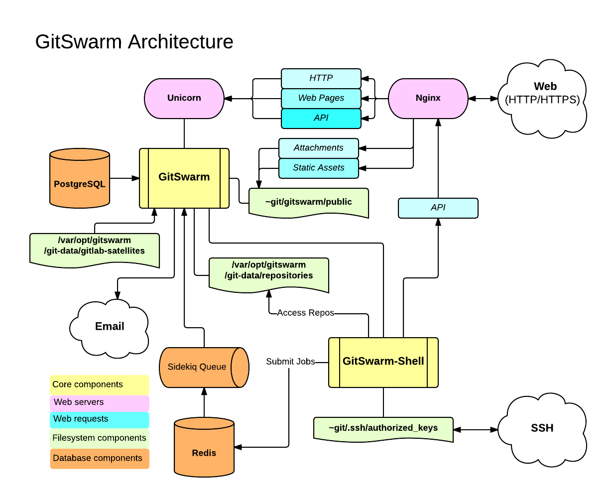

# GitSwarm Architecture Overview

## Software delivery

Currently, GitSwarm is only available as packages.

## Physical office analogy

You can imagine GitSwarm as a physical office.

**The repositories** are the goods GitSwarm handling. They can be stored in
a warehouse.  This can be either a hard disk, or something more complex,
such as a NFS filesystem.

**Nginx** acts like the front-desk. Users come to Nginx and request
actions to be done by workers in the office.

**The database** is a series of metal file cabinets with information on:
 - The goods in the warehouse (metadata, issues, merge requests etc).
 - The users coming to the front desk (permissions).

**Redis** is a communication board with "cubby holes" that can contain
tasks for office workers.

**Sidekiq** is a worker that primarily handles sending out emails. It takes
tasks from the Redis communication board.

**A Unicorn worker** is a worker that handles quick/mundane tasks. They
work with the communication board (Redis). Their job description:
 - check permissions by checking the user session stored in a Redis "cubby
   hole".
 - make tasks for Sidekiq.
 - fetch stuff from the warehouse or move things around in there.

**Gitlab-shell** is a third kind of worker that takes orders from a fax
machine (SSH) instead of the front desk (HTTP). Gitlab-shell communicates
with Sidekiq via the "communication board" (Redis), and asks quick
questions of the Unicorn workers either directly or via the front desk.

**GitSwarm (the application)** is the collection of processes and business
practices that the office is run by.

## System Layout

When referring to ~git in the pictures it means the home directory of the
git user which is typically /home/git.

GitSwarm is primarily installed within the `/home/git` user home directory
as `git` user. Within the home directory is where the GitSwarm server
software resides as well as the repositories (though the repository
location is configurable).

The bare repositories are located in `/home/git/repositories`. GitSwarm is
a Ruby on Rails application, so the particulars of the inner workings can
be learned by studying how a Ruby on Rails application works.

To serve repositories over SSH there is an add-on application called
gitlab-shell, which is included with GitSwarm and is installed in
`/home/git/gitlab-shell`.

### Components



A typical install of GitSwarm is on GNU/Linux. It uses Nginx as a web front
end to proxypass the Unicorn web server. By default, communication between
Unicorn and the front end is via a Unix domain socket but forwarding
requests via TCP is also supported. The web front end accesses
`/home/git/gitlab/public` bypassing the Unicorn server to serve static
pages, uploads (e.g. avatar images or attachments), and precompiled assets.
GitLab serves web pages and a [GitSwarm API](../api/README.md) using the
Unicorn web server. It uses Sidekiq as a job queue which, in turn, uses
Redis as a non-persistent database backend for job information, meta data,
and incoming jobs.


The GitSwarm web app uses PostgreSQL for persistent database information
(e.g. users, permissions, issues, other meta data). GitSwarm stores the
bare git repositories it serves in `/home/git/repositories` by default. It
also keeps default branch and hook information with the bare repository.
`/home/git/gitlab-satellites` keeps checked out repositories when
performing actions such as a merge request, editing files in the web
interface, etc.

The satellite repository is used by the web interface for editing
repositories and the wiki which is also a git repository. When serving
repositories over HTTP/HTTPS GitSwarm utilizes the GitSwarm API to resolve
authorization and access as well as serving git objects.

The add-on component gitlab-shell serves repositories over SSH. It manages
the SSH keys within `/home/git/.ssh/authorized_keys` which should not be
manually edited. gitlab-shell accesses the bare repositories directly to
serve git objects and communicates with Redis to submit jobs to Sidekiq for
GitSwarm to process. gitlab-shell queries the GitSwarm API to determine
authorization and access.

### Installation Folder Summary

To summarize, here is the [directory structure of the `git` user home
directory](../install/structure.md).

### Processes

```
ps aux | grep '^git'
```

GitSwarm has several components to operate. As a system user (i.e. any user
that is not the `git` user) it requires a persistent database
(PostreSQL) and Redis database. It also uses Nginx to proxypass
Unicorn. As the `git` user it starts Sidekiq and Unicorn (a simple ruby
HTTP server running on port `8080` by default). Under the GitSwarm user,
there are normally 4 processes: `unicorn_rails master` (1 process),
`unicorn_rails worker` (2 processes), `sidekiq` (1 process).

### Repository access

Repositories get accessed via HTTP or SSH. HTTP cloning/push/pull utilizes
the GitSwarm API and SSH cloning is handled by gitlab-shell (previously
explained).

## Troubleshooting

See the README for more information.

### Init scripts of the services

The GitSwarm init script starts and stops Unicorn and Sidekiq.

```
/etc/init.d/gitswarm
Usage: service gitswarm {start|stop|restart|reload|status}
```

Redis (key-value store/non-persistent database)

```
/etc/init.d/redis
Usage: /etc/init.d/redis {start|stop|status|restart|condrestart|try-restart}
```

SSH daemon

```
/etc/init.d/sshd
Usage: /etc/init.d/sshd {start|stop|restart|reload|force-reload|condrestart|try-restart|status}
```

Web server

```
/etc/init.d/nginx
Usage: nginx {start|stop|restart|reload|force-reload|status|configtest}
```

Persistent database

```
/etc/init.d/postgresql
Usage: /etc/init.d/postgresql {start|stop|restart|reload|force-reload|status} [version ..]
```

### Log locations of the services

Note: `/home/git/` is shorthand for `/home/git`.

GitSwarm (includes Unicorn and Sidekiq logs)

- `/home/git/gitlab/log/` contains `application.log`, `production.log`, `sidekiq.log`, `unicorn.stdout.log`, `githost.log`, `satellites.log`, and `unicorn.stderr.log` normally.

gitlab-shell

- `/home/git/gitlab-shell/gitlab-shell.log`

SSH

- `/var/log/auth.log` auth log (on Ubuntu).
- `/var/log/secure` auth log (on RHEL).

Nginx

- `/var/log/nginx/` contains error and access logs.

Redis

- `/var/log/redis/redis.log` there are also log-rotated logs there.

PostgreSQL

- `/var/log/postgresql/*`

### GitSwarm specific config files

GitSwarm has configuration files located in `/home/git/gitlab/config/*`.
Commonly referenced config files include:

- `gitlab.yml` - GitLab configuration.
- `unicorn.rb` - Unicorn web server settings.
- `database.yml` - Database connection settings.

gitlab-shell has a configuration file at `/home/git/gitlab-shell/config.yml`.

### Maintenance Tasks

GitSwarm provides rake tasks with which you see version information and run
a quick check on your configuration to ensure it is configured properly
within the application. See [maintenance rake
tasks](..//raketasks/maintenance.md). In a nutshell, do the following:

```
sudo -i -u git
cd gitlab
bundle exec rake gitswarm:env:info RAILS_ENV=production
bundle exec rake gitswarm:check RAILS_ENV=production
```

Note: It is recommended to log into the `git` user using `sudo -i -u git`
or `sudo su - git`. While the sudo commands provided by GitSwarm work in
Ubuntu they do not always work in RHEL.
